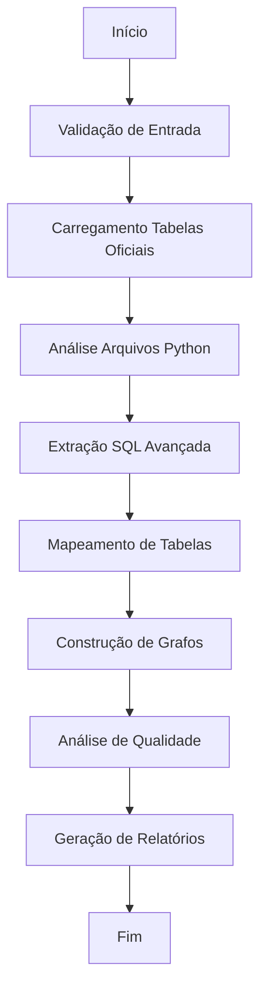

# BW_AUTOMATE 🚀

## Mapeamento Avançado de Tabelas PostgreSQL em Códigos Python do Airflow


**BW_AUTOMATE** é uma ferramenta completa e automatizada para análise, mapeamento e documentação de tabelas PostgreSQL utilizadas em códigos Python do Apache Airflow. A ferramenta identifica todas as operações de banco de dados, mapeia fluxos de dados e gera relatórios executivos e técnicos detalhados.

---

## 📋 Índice

- [Características Principais](#-características-principais)
- [Instalação](#-instalação)
- [Uso Rápido](#-uso-rápido)
- [Configuração](#-configuração)
- [Relatórios Gerados](#-relatórios-gerados)
- [Arquitetura](#-arquitetura)
- [Exemplos Avançados](#-exemplos-avançados)
- [Troubleshooting](#-troubleshooting)
- [Contribuição](#-contribuição)
- [Roadmap](#-roadmap)

---

## 🌟 Características Principais

### 🔍 **Análise Inteligente de Código**
- ✅ Detecção automática de operações SQL em strings, pandas, SQLAlchemy
- ✅ Suporte a F-strings e SQL dinâmico
- ✅ Análise de CTEs, subqueries e junções complexas
- ✅ Identificação de padrões específicos do Airflow

### 🗺️ **Mapeamento e Conciliação**
- ✅ Matching exato e fuzzy com tabelas oficiais
- ✅ Detecção automática de schemas e namespaces
- ✅ Identificação de tabelas temporárias e dinâmicas
- ✅ Análise de confiança e qualidade dos dados

### 📊 **Visualizações e Relatórios**
- ✅ Dashboard executivo interativo
- ✅ Relatório técnico detalhado
- ✅ Visualização de linhagem de dados
- ✅ Explorador interativo de tabelas
- ✅ Export para Power BI/Excel

### 🔗 **Análise de Dependências**
- ✅ Grafo de fluxo de dados
- ✅ Mapeamento de dependências entre DAGs
- ✅ Identificação de tabelas críticas
- ✅ Detecção de tabelas órfãs

---

## 🚀 Instalação

### Pré-requisitos
- Python 3.8 ou superior
- Sistema operacional: Windows, macOS ou Linux
- Memória RAM: Mínimo 4GB (recomendado 8GB)

### Instalação Básica

```bash
# Clone ou baixe os arquivos do BW_AUTOMATE
cd /caminho/para/seu/projeto

# Crie um ambiente virtual (recomendado)
python -m venv bw_automate_env
source bw_automate_env/bin/activate  # Linux/macOS
# ou
bw_automate_env\\Scripts\\activate  # Windows

# Instale as dependências
pip install -r BW_AUTOMATE/requirements.txt
```

### Instalação com Conda

```bash
# Crie ambiente conda
conda create -n bw_automate python=3.9
conda activate bw_automate

# Instale dependências principais
conda install pandas numpy matplotlib seaborn plotly networkx
pip install -r BW_AUTOMATE/requirements.txt
```

### Verificação da Instalação

```bash
cd BW_AUTOMATE
python run_analysis.py --version
```

---

## ⚡ Uso Rápido

### Comando Básico

```bash
python BW_AUTOMATE/run_analysis.py \\
  --source-dir /caminho/para/airflow/dags \\
  --tables-xlsx /caminho/para/lista_tabelas.xlsx
```

### Exemplo Completo

```bash
# Navegar até o diretório do projeto
cd /home/dev/code/labcom_etiquetas

# Executar análise completa
python BW_AUTOMATE/run_analysis.py \\
  --source-dir ./backend \\
  --tables-xlsx ./tabelas_postgresql.xlsx \\
  --config BW_AUTOMATE/config.json \\
  --output-dir ./relatorios_bw \\
  --verbose
```

### Saída Esperada

```
🎯 BW_AUTOMATE - RESUMO DA EXECUÇÃO
================================================================================
⏱️  Tempo de execução: 0:02:34.567890
📁 Arquivos analisados: 45
🗃️  Tabelas encontradas: 127
📊 Statements SQL: 89
📋 Tabelas oficiais: 156
✅ Taxa de match: 87.4%
🔍 Confiança média: 82.3%

📑 Relatórios gerados: 8
   • executive_dashboard: ./relatorios_bw/executive_dashboard_20250920_143021.html
   • technical_report: ./relatorios_bw/technical_report_20250920_143021.html
   • table_explorer: ./relatorios_bw/table_explorer_20250920_143021.html
   • powerbi_export: ./relatorios_bw/powerbi_export_20250920_143021.xlsx

✨ Análise concluída com sucesso!
================================================================================
```

---

## ⚙️ Configuração

### Arquivo de Configuração (`config.json`)

O BW_AUTOMATE utiliza um arquivo JSON para configurações avançadas:

```json
{
  "analysis_settings": {
    "fuzzy_match_threshold": 80,
    "include_temp_tables": true,
    "schemas_to_analyze": ["public", "staging", "reports"],
    "max_files_to_analyze": 1000
  },
  "reporting": {
    "generate_executive_dashboard": true,
    "generate_technical_report": true,
    "export_to_powerbi": true
  }
}
```

### Principais Configurações

| Configuração | Descrição | Padrão |
|-------------|-----------|---------|
| `fuzzy_match_threshold` | Limite para matching fuzzy (0-100) | 80 |
| `include_temp_tables` | Incluir tabelas temporárias | true |
| `schemas_to_analyze` | Schemas a analisar | ["public", "staging"] |
| `max_files_to_analyze` | Máximo de arquivos para processar | 1000 |
| `log_level` | Nível de log (DEBUG, INFO, WARNING) | INFO |

### Configurações Avançadas

```json
{
  "sql_extraction": {
    "include_dynamic_sql": true,
    "parse_multiline_strings": true,
    "minimum_sql_length": 10
  },
  "table_matching": {
    "schema_weight_boost": 1.2,
    "remove_prefixes": ["tmp_", "temp_"],
    "case_sensitive": false
  },
  "performance": {
    "parallel_processing": false,
    "max_workers": 4,
    "memory_limit_mb": 1024
  }
}
```

---

## 📊 Relatórios Gerados

### 1. **Dashboard Executivo** 📈
- **Arquivo**: `executive_dashboard_YYYYMMDD_HHMMSS.html`
- **Conteúdo**: Visão geral com métricas principais, gráficos interativos
- **Público**: Gestores, stakeholders

**Principais Métricas:**
- Taxa de match com tabelas oficiais
- Distribuição por schemas
- Top tabelas mais utilizadas
- Operações por tipo (READ/WRITE)

### 2. **Relatório Técnico** 📋
- **Arquivo**: `technical_report_YYYYMMDD_HHMMSS.html`
- **Conteúdo**: Análise detalhada, metodologia, recomendações
- **Público**: Desenvolvedores, arquitetos

**Seções Incluídas:**
- Metodologia de análise
- Análise por arquivo
- Detalhes de matching
- Recomendações técnicas

### 3. **Explorador de Tabelas** 🔍
- **Arquivo**: `table_explorer_YYYYMMDD_HHMMSS.html`
- **Conteúdo**: Interface interativa para explorar tabelas
- **Funcionalidades**: Filtros, busca, ordenação

### 4. **Visualização de Linhagem** 🌐
- **Arquivo**: `data_lineage_YYYYMMDD_HHMMSS.html`
- **Conteúdo**: Grafo interativo do fluxo de dados
- **Visualiza**: Relacionamentos entre tabelas

### 5. **Export Power BI** 📊
- **Arquivo**: `powerbi_export_YYYYMMDD_HHMMSS.xlsx`
- **Conteúdo**: Dados estruturados para importação no Power BI
- **Sheets**: Resumo, Tabelas, Matches, Métricas

### 6. **Arquivos CSV** 📄
- `table_mappings_YYYYMMDD_HHMMSS.csv`: Mapeamento detalhado
- `dependency_matrix_YYYYMMDD_HHMMSS.csv`: Matriz de dependências
- `found_tables_YYYYMMDD_HHMMSS.csv`: Tabelas encontradas

---

## 🏗️ Arquitetura

### Estrutura de Módulos

```
BW_AUTOMATE/
├── run_analysis.py              # Script principal
├── airflow_table_mapper.py      # Análise principal de arquivos
├── sql_pattern_extractor.py     # Extração avançada de SQL
├── table_mapper_engine.py       # Engine de mapeamento
├── report_generator.py          # Geração de relatórios
├── config.json                  # Configurações
├── requirements.txt             # Dependências
├── README.md                    # Documentação
└── reports/                     # Relatórios gerados
    ├── logs/                    # Logs de execução
    └── cache/                   # Cache (se habilitado)
```

### Fluxo de Execução



### Algoritmos Principais

#### 1. **Extração de Tabelas**
- Regex patterns para diferentes contextos SQL
- AST parsing para strings multi-linha
- Normalização de nomes de tabelas

#### 2. **Matching Algorithm**
```python
def match_table(found_table, official_tables):
    # 1. Exact match
    if exact_match_found:
        return ExactMatch(confidence=100)
    
    # 2. Fuzzy match
    best_score = 0
    for official_table in official_tables:
        score = fuzz.ratio(found_table, official_table)
        if same_schema:
            score *= 1.2  # Schema boost
        best_score = max(best_score, score)
    
    return FuzzyMatch(confidence=best_score)
```

#### 3. **Quality Metrics**
- Taxa de match = (exact_matches + fuzzy_matches) / total_found
- Confiança média = sum(confidence_scores) / total_matches
- Cobertura = tables_found / total_official_tables

---

## 🎯 Exemplos Avançados

### Exemplo 1: Análise de Projeto Específico

```bash
# Analisar apenas arquivos de um schema específico
python BW_AUTOMATE/run_analysis.py \\
  --source-dir ./dags/finance \\
  --tables-xlsx ./schemas/finance_tables.xlsx \\
  --config ./configs/finance_config.json
```

**finance_config.json:**
```json
{
  "analysis_settings": {
    "schemas_to_analyze": ["finance", "public"],
    "exclude_patterns": ["test_", "dev_"],
    "fuzzy_match_threshold": 90
  },
  "reporting": {
    "include_recommendations": true,
    "max_chart_items": 30
  }
}
```

### Exemplo 2: Análise em Lote

```bash
#!/bin/bash
# Script para analisar múltiplos projetos

PROJECTS=("project_a" "project_b" "project_c")
BASE_DIR="/data/airflow_projects"

for project in "${PROJECTS[@]}"; do
    echo "Analisando $project..."
    python BW_AUTOMATE/run_analysis.py \\
        --source-dir "$BASE_DIR/$project/dags" \\
        --tables-xlsx "$BASE_DIR/$project/tables.xlsx" \\
        --output-dir "./reports/$project" \\
        --config "./configs/${project}_config.json"
done
```

### Exemplo 3: Configuração para Desenvolvimento

**dev_config.json:**
```json
{
  "analysis_settings": {
    "max_files_to_analyze": 50,
    "include_temp_tables": true,
    "fuzzy_match_threshold": 70
  },
  "logging": {
    "log_level": "DEBUG",
    "log_to_console": true
  },
  "reporting": {
    "generate_executive_dashboard": false,
    "generate_technical_report": true
  }
}
```

### Exemplo 4: Integração com CI/CD

```yaml
# .github/workflows/table-mapping.yml
name: Table Mapping Analysis

on:
  push:
    branches: [main]
  pull_request:
    branches: [main]

jobs:
  analyze:
    runs-on: ubuntu-latest
    steps:
    - uses: actions/checkout@v3
    
    - name: Set up Python
      uses: actions/setup-python@v3
      with:
        python-version: '3.9'
    
    - name: Install dependencies
      run: |
        pip install -r BW_AUTOMATE/requirements.txt
    
    - name: Run BW_AUTOMATE
      run: |
        python BW_AUTOMATE/run_analysis.py \\
          --source-dir ./dags \\
          --tables-xlsx ./schemas/tables.xlsx \\
          --output-dir ./reports
    
    - name: Upload reports
      uses: actions/upload-artifact@v3
      with:
        name: mapping-reports
        path: ./reports/
```

---

## 🔧 Troubleshooting

### Problemas Comuns

#### 1. **Erro de Importação de Módulos**
```
ImportError: No module named 'fuzzywuzzy'
```
**Solução:**
```bash
pip install fuzzywuzzy python-levenshtein
```

#### 2. **Arquivo XLSX Não Encontrado**
```
FileNotFoundError: Arquivo de tabelas não encontrado
```
**Solução:**
- Verifique se o caminho está correto
- Confirme que o arquivo tem extensão .xlsx ou .xls
- Teste com caminho absoluto

#### 3. **Memória Insuficiente**
```
MemoryError: Unable to allocate array
```
**Solução:**
```json
{
  "analysis_settings": {
    "max_files_to_analyze": 500
  },
  "performance": {
    "memory_limit_mb": 512
  }
}
```

#### 4. **Baixa Taxa de Match**
**Possíveis causas:**
- Nomenclatura inconsistente
- Schemas não mapeados
- Threshold muito alto

**Soluções:**
```json
{
  "table_matching": {
    "fuzzy_match_threshold": 70,
    "remove_prefixes": ["tmp_", "dev_"],
    "case_sensitive": false
  }
}
```

### Logs de Debug

Para investigar problemas, habilite logs detalhados:

```bash
python BW_AUTOMATE/run_analysis.py \\
  --source-dir ./dags \\
  --tables-xlsx ./tables.xlsx \\
  --verbose
```

Os logs serão salvos em `BW_AUTOMATE/logs/`.

### Validação de Configuração

Teste sua configuração antes da execução:

```python
import json

# Valida JSON
with open('config.json', 'r') as f:
    config = json.load(f)
    print("✅ Configuração válida")
```

---

## 🤝 Contribuição

### Como Contribuir

1. **Fork** do projeto
2. Crie uma **branch** para sua feature (`git checkout -b feature/nova-funcionalidade`)
3. **Commit** suas mudanças (`git commit -am 'Adiciona nova funcionalidade'`)
4. **Push** para a branch (`git push origin feature/nova-funcionalidade`)
5. Abra um **Pull Request**

### Diretrizes de Código

- Siga o padrão PEP 8
- Adicione docstrings para funções públicas
- Inclua testes para novas funcionalidades
- Mantenha compatibilidade com Python 3.8+

### Estrutura de Testes

```bash
# Executar testes
pytest BW_AUTOMATE/tests/

# Cobertura de testes
pytest --cov=BW_AUTOMATE BW_AUTOMATE/tests/
```

---

## 🗺️ Roadmap

### Versão 1.1 (Em Desenvolvimento)
- [ ] Suporte a outros SGBDs (MySQL, Oracle)
- [ ] Interface web para visualização
- [ ] API REST para integração
- [ ] Detecção automática de padrões ETL

### Versão 1.2 (Planejado)
- [ ] Machine Learning para melhoria do matching
- [ ] Análise de performance de queries
- [ ] Integração com Airflow API
- [ ] Suporte a Kubernetes

### Versão 2.0 (Futuro)
- [ ] Análise em tempo real
- [ ] Alertas automáticos para mudanças
- [ ] Dashboard em tempo real
- [ ] Integração com ferramentas de governança

---

## 📞 Suporte e Contato

### Documentação Adicional
- [Wiki do Projeto](../../wiki)
- [FAQ](docs/FAQ.md)
- [Exemplos](docs/examples/)

### Reportar Problemas
- Abra uma [Issue](../../issues) no GitHub
- Inclua logs de erro e configuração
- Descreva o comportamento esperado vs atual

### Comunidade
- [Discussões](../../discussions)
- [Canal Slack](#) (em breve)

---

## 📄 Licença

Este projeto está licenciado sob a Licença MIT - veja o arquivo [LICENSE](LICENSE) para detalhes.

---

## 🙏 Agradecimentos

- **Apache Airflow** pela inspiração e casos de uso
- **Pandas** e **NetworkX** pelas bibliotecas fundamentais
- **Plotly** pelas visualizações interativas
- **Comunidade Python** pelo ecossistema incrível

---

## 📊 Estatísticas do Projeto


---

**Criado com ❤️ para a comunidade de Data Engineering**

*BW_AUTOMATE - Tornando o mapeamento de dados mais simples e eficiente.*